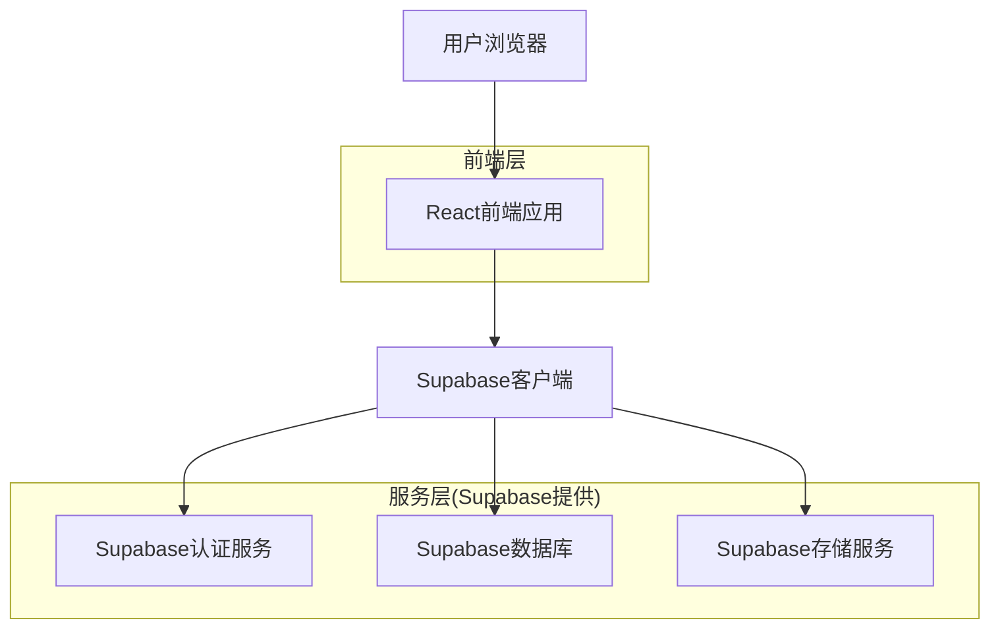
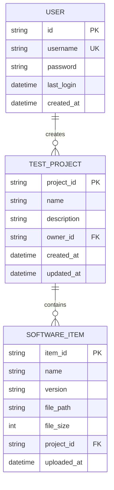
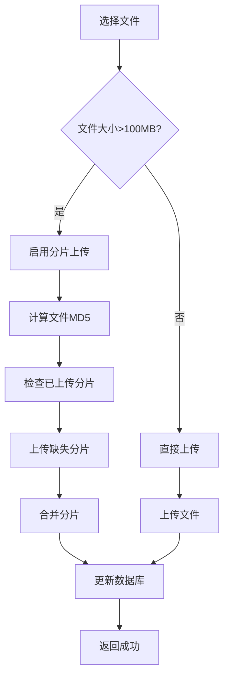

## 1. 架构设计



## 2. 技术栈描述

- **前端**: React@18 + TypeScript + TailwindCSS@3 + Vite
- **初始化工具**: vite-init
- **UI组件库**: shadcn/ui + Radix UI
- **状态管理**: React Context + Zustand
- **后端**: Supabase (BaaS)
- **数据库**: PostgreSQL (通过Supabase)
- **文件存储**: Supabase Storage
- **认证授权**: Supabase Auth

## 3. 路由定义

| 路由 | 用途 |
|------|------|
| /login | 登录页面，用户认证入口 |
| /projects | 工程列表页，展示用户所有测试工程 |
| /projects/new | 新建工程页面，创建测试工程 |
| /projects/:id/overview | 工程概览页，显示工程统计信息 |
| /projects/:id/items | 项目管理页，管理工程下的软件项目 |

## 4. API定义

### 4.1 工程管理API

**创建工程**
```
POST /api/projects
```

请求体：
| 参数名 | 类型 | 必填 | 描述 |
|--------|------|------|------|
| name | string | 是 | 工程名称，最大64字符 |
| description | string | 否 | 工程描述，最大500字符 |

响应：
```json
{
  "project_id": "uuid",
  "name": "测试工程名称",
  "description": "工程描述",
  "created_at": "2024-01-01T00:00:00Z"
}
```

**获取工程列表**
```
GET /api/projects?search={keyword}&sort={field}&order={asc|desc}&page={number}&limit={number}
```

**获取工程详情**
```
GET /api/projects/:id
```

**删除工程**
```
DELETE /api/projects/:id
```

### 4.2 项目管理API

**上传软件项目**
```
POST /api/projects/:id/items/upload
```

支持分片上传，大文件自动启用断点续传。

**获取项目列表**
```
GET /api/projects/:id/items?search={keyword}&page={number}&limit={number}
```

**下载项目**
```
GET /api/projects/:id/items/:itemId/download
```

**删除项目**
```
DELETE /api/projects/:id/items/:itemId
```

批量删除：
```
POST /api/projects/:id/items/batch-delete
```

请求体：
```json
{
  "item_ids": ["id1", "id2", "id3"]
}
```

## 5. 数据模型

### 5.1 实体关系图



### 5.2 数据库表结构

**用户表 (users)** - 已存在，无需修改
```sql
-- 用户表保持不变
CREATE TABLE users (
  id UUID PRIMARY KEY DEFAULT gen_random_uuid(),
  username VARCHAR(255) UNIQUE NOT NULL,
  password VARCHAR(255) NOT NULL,
  last_login TIMESTAMP WITH TIME ZONE,
  created_at TIMESTAMP WITH TIME ZONE DEFAULT NOW()
);
```

**测试工程表 (test_projects)** - 重命名原project表
```sql
-- 重命名现有project表并添加字段
ALTER TABLE projects RENAME TO test_projects;

-- 添加新字段
ALTER TABLE test_projects 
ADD COLUMN updated_at TIMESTAMP WITH TIME ZONE DEFAULT NOW(),
ADD COLUMN item_count INTEGER DEFAULT 0,
ADD COLUMN last_upload_at TIMESTAMP WITH TIME ZONE;

-- 更新索引
CREATE INDEX idx_test_projects_owner_id ON test_projects(owner_id);
CREATE INDEX idx_test_projects_created_at ON test_projects(created_at DESC);
```

**软件项目表 (software_items)** - 新建表
```sql
-- 创建软件项目表
CREATE TABLE software_items (
  item_id UUID PRIMARY KEY DEFAULT gen_random_uuid(),
  project_id UUID NOT NULL REFERENCES test_projects(project_id) ON DELETE CASCADE,
  name VARCHAR(255) NOT NULL,
  version VARCHAR(100),
  file_path VARCHAR(500) NOT NULL,
  file_size BIGINT NOT NULL,
  uploaded_at TIMESTAMP WITH TIME ZONE DEFAULT NOW(),
  created_by UUID NOT NULL REFERENCES users(id)
);

-- 创建索引
CREATE INDEX idx_software_items_project_id ON software_items(project_id);
CREATE INDEX idx_software_items_name ON software_items(name);
CREATE INDEX idx_software_items_uploaded_at ON software_items(uploaded_at DESC);
```

### 5.3 Supabase RLS策略

**测试工程表策略**
```sql
-- 允许用户查看自己的工程
CREATE POLICY "用户可查看自己的工程" ON test_projects
FOR SELECT USING (auth.uid() = owner_id);

-- 允许用户创建工程
CREATE POLICY "用户可创建工程" ON test_projects
FOR INSERT WITH CHECK (auth.uid() = owner_id);

-- 允许用户更新自己的工程
CREATE POLICY "用户可更新自己的工程" ON test_projects
FOR UPDATE USING (auth.uid() = owner_id);

-- 允许用户删除自己的工程
CREATE POLICY "用户可删除自己的工程" ON test_projects
FOR DELETE USING (auth.uid() = owner_id);
```

**软件项目表策略**
```sql
-- 允许工程成员查看项目
CREATE POLICY "工程成员可查看项目" ON software_items
FOR SELECT USING (
  EXISTS (
    SELECT 1 FROM test_projects 
    WHERE test_projects.project_id = software_items.project_id 
    AND test_projects.owner_id = auth.uid()
  )
);

-- 允许工程成员创建项目
CREATE POLICY "工程成员可创建项目" ON software_items
FOR INSERT WITH CHECK (
  EXISTS (
    SELECT 1 FROM test_projects 
    WHERE test_projects.project_id = software_items.project_id 
    AND test_projects.owner_id = auth.uid()
  )
);

-- 允许工程成员删除项目
CREATE POLICY "工程成员可删除项目" ON software_items
FOR DELETE USING (
  EXISTS (
    SELECT 1 FROM test_projects 
    WHERE test_projects.project_id = software_items.project_id 
    AND test_projects.owner_id = auth.uid()
  )
);
```

## 6. 文件上传架构

### 6.1 大文件上传流程


### 6.2 前端上传组件
- 使用React Dropzone处理文件拖拽
- 实现分片上传逻辑，每片5MB
- 显示上传进度条和速度
- 支持暂停/继续上传
- 上传完成后自动刷新项目列表

### 6.3 后端处理
- Supabase Storage存储文件
- 数据库记录文件元信息
- 实现断点续传检查接口
- 自动清理未完成的上传任务

## 7. 性能优化

### 7.1 前端优化
- 虚拟滚动处理大量项目列表
- React.memo优化组件重渲染
- 图片和文件懒加载
- 使用Service Worker缓存静态资源

### 7.2 数据库优化
- 合理创建索引提高查询性能
- 使用分页避免一次性加载大量数据
- 定期清理过期数据
- 监控慢查询并优化

### 7.3 监控指标
- 工程列表1000条数据渲染时间 < 500ms
- 文件上传成功率100% (1GB文件)
- 内存占用 < 200MB
- API响应时间 < 200ms