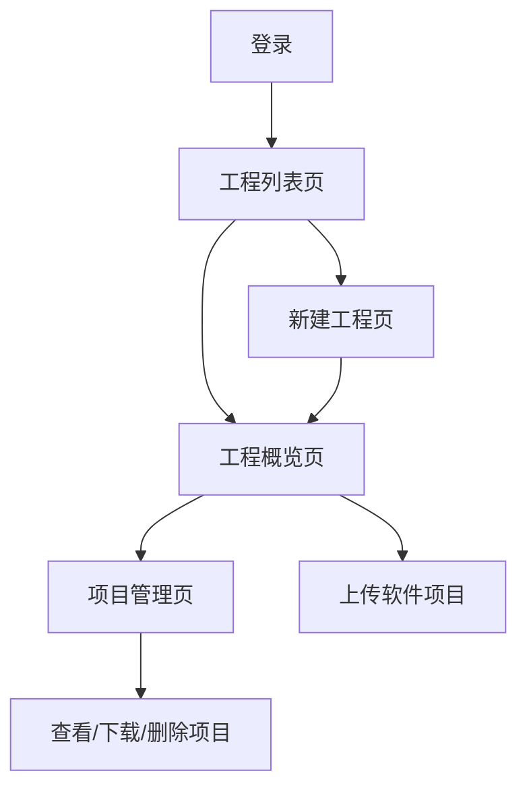

## 1. 产品概述
本次升级将现有门户网站重构为以"测试工程"为核心的项目管理体系。测试工程作为最高层级容器，统一管理多个软件项目，解决原有单项目管理的局限性，提升大型测试场景下的组织效率。

目标用户为测试工程师和项目经理，通过层级化结构实现更清晰的项目归属和数据隔离，支持团队协作和权限管理。

## 2. 核心功能

### 2.1 用户角色
| 角色 | 注册方式 | 核心权限 |
|------|----------|----------|
| 普通用户 | 用户名密码注册 | 创建和管理自己的测试工程，上传软件项目 |
| 工程成员 | 工程创建者邀请 | 查看和操作被授权的测试工程 |

### 2.2 功能模块
测试工程门户包含以下核心页面：
1. **工程列表页**：展示用户所有测试工程，支持搜索、排序、分页
2. **新建工程页**：创建新的测试工程，填写基本信息
3. **工程概览页**：显示工程统计信息和上传入口
4. **项目管理页**：管理工程下的软件项目，支持批量操作

### 2.3 页面详情
| 页面名称 | 模块名称 | 功能描述 |
|----------|----------|----------|
| 工程列表页 | 工程列表 | 展示用户所有测试工程，支持按名称搜索、按创建时间/名称排序、分页浏览 |
| 工程列表页 | 新建按钮 | 右上角常驻"新建测试工程"按钮，主色调突出显示 |
| 工程列表页 | 空状态 | 无工程时中央显示占位文案，可点击跳转新建页面 |
| 新建工程页 | 工程名称 | 必填输入框，最大64字符，仅允许中文、字母、数字、下划线 |
| 新建工程页 | 工程描述 | 选填文本域，最大500字符，支持换行 |
| 新建工程页 | 创建按钮 | 前端校验后调用接口，成功后跳转工程概览页 |
| 工程概览页 | 顶部导航 | 显示当前工程名称，提供"工程概览"和"项目管理"Tab切换 |
| 工程概览页 | 统计信息 | 展示工程名称、描述、创建时间、更新时间、软件项目数量、最近上传时间 |
| 工程概览页 | 上传按钮 | 点击上传软件项目，上传成功后归属当前工程 |
| 项目管理页 | 项目卡片 | 卡片列表展示软件项目，显示名称、版本、上传时间、文件大小 |
| 项目管理页 | 操作按钮 | 每个项目提供查看、下载、删除操作 |
| 项目管理页 | 批量操作 | 支持多选项目和批量删除 |
| 项目管理页 | 搜索分页 | 支持按项目名称搜索和分页浏览 |

## 3. 核心流程
用户登录成功后默认进入工程列表页。若无工程可点击新建创建测试工程；若有工程可直接进入查看。在工程内部，用户可在概览页查看统计信息并上传新项目，或在项目管理页查看和管理所有软件项目。

所有数据按工程维度隔离，用户只能访问自己有权限的工程。删除操作需要二次确认，大文件上传显示进度条。

## 4. 用户界面设计

### 4.1 设计风格
- **主色调**：深蓝色 (#1E40AF) 作为品牌色，浅灰色 (#F3F4F6) 作为背景
- **按钮样式**：圆角矩形，主要操作为主色调，次要操作为边框样式
- **字体**：系统默认字体，标题16px，正文14px，小字12px
- **布局风格**：顶部导航 + 卡片式内容区域，左侧边栏可选
- **图标风格**：简洁线性图标，使用Lucide React图标库

### 4.2 页面设计概览
| 页面名称 | 模块名称 | UI元素 |
|----------|----------|--------|
| 工程列表页 | 顶部栏 | 页面标题居左，新建按钮居右，主色调突出 |
| 工程列表页 | 列表区域 | 卡片网格布局，每张卡片显示工程名称和描述，悬停效果 |
| 工程列表页 | 空状态 | 中央图标 + 文案，点击区域高亮显示 |
| 新建工程页 | 表单区域 | 居中卡片布局，输入框带字符计数，错误提示红色显示 |
| 工程概览页 | 顶部导航 | 工程名称左侧，Tab切换右侧，当前选中下划线标识 |
| 工程概览页 | 统计卡片 | 网格布局展示各项统计数据，数字大字体突出 |
| 项目管理页 | 项目卡片 | 横向卡片列表，文件图标 + 项目信息 + 操作按钮 |

### 4.3 响应式设计
采用桌面端优先设计，适配1200px以上屏幕。移动端适配考虑触摸交互优化，卡片布局在窄屏下自动调整为单列显示。

### 4.4 交互细节
- 加载状态：骨架屏占位，避免空白等待
- 错误提示：顶部通知栏，包含错误码和友好文案
- 确认对话框：显示删除对象名称，防止误操作
- 文件上传：拖拽上传区域，进度条实时显示
- 搜索反馈：实时搜索结果，高亮匹配关键词